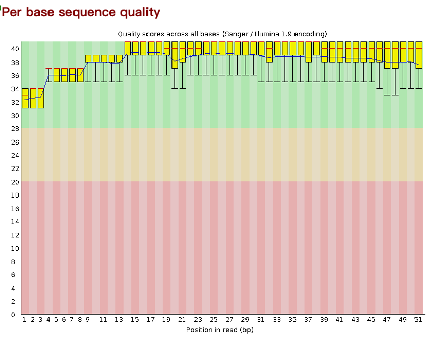

# QUIZ exRNA PARTI-Prepare Data Matrix
>Contribution:  谢龙芯: shell部分（预质控至定量）；杨时茂: python部分（PCC至SampleQC）
## Part 1 Reads Processing and Mapping
###1.QC
>使用fastqc进行质控分析，并使用multiqc展示汇总的多样本结果。
```bash
mkdir -p raw_data/QC_report/first_report
fastqc -q -o raw_data/QC_report/first_report raw_data/*.fastq -t 8
multiqc -o raw_data/QC_report/first_report raw_data/QC_report/first_report
```
>multiqc的结果（部分）。

 

 
###2.Trimming
>使用cutadapt去除adaptor并截短过长的序列，处理标准为质量值大于30、最短长度15nt。为便于后续样本质控，输出结果报告到report文件。
```bash
mkdir -p raw_data/cutadapt
cd raw_data
for fn in *.fastq
do
cutadapt -a AGATCGGAAGAG -q 30 -m 16 --trim-n -j 8 -o cutadapt/cutadapt_${fn} ${fn} > cutadapt1/cutadapt_${fn}_report.txt
done
cd ..
```
###3.Mapping 
>使用bowtie2 比对到不同RNA种类。
先将rRNA完成mapping，并输出mapping后的.sam文件以及未mapping上序列的.fastq文件。
```bash
mkdir mapping
for sn in N1 N7 N13 N19 N25
do
mkdir -p mapping/${sn}
bowtie2 -p 10  -x RNA_index/rRNA --un mapping/${sn}/unmapped_1_${sn}.fastq raw_data/cutadapt/cutadapt_Sample_${sn}.fastq -S mapping/${sn}/${sn}_rRNA.sam
done
```
>再依次mapping其他种类RNA，使用脚本批量处理。
```bash
for sn in N1 N7 N13 N19 N25
do
count=2
for k in miRNA piRNA Y_RNA snRNA snoRNA srpRNA tRNA lncRNA mRNA tucp canonical_ncRNA
do
let precount=$count-1

bowtie2 -p 10  -x RNA_index/${k} --un mapping/${sn}/unmapped_${count}_${sn}.fastq mapping/${sn}/unmapped_${precount}_${sn}.fastq -S mapping/${sn}/${sn}_${k}.sam
let count=$count+1 #shell真是一种反人类的语言
done
done
```
>最后mapping剩余序列到hg38。
```bash
for sn in N1 N7 N13 N19 N25
do
bowtie2 -p 10  -x hg38/GRCh38_p10 --un mapping/${sn}/unmapped_remained_${sn}.fastq mapping/${sn}/unmapped_12_${sn}.fastq -S mapping/${sn}/${sn}_others_hg38.sam
done
```
>使用rsem和将各种rRNA的.sam文件转化为.bam文件
```bash
for sn in N1 N7 N13 N19 N25
do
for k in rRNA miRNA piRNA Y_RNA snRNA snoRNA srpRNA tRNA lncRNA mRNA tucp canonical_ncRNA
do
rsem-tbam2gbam RNA_index/${k} mapping/${sn}/${sn}_${k}.sam mapping/${sn}/${sn}_${k}.bam
done
done
```
>使用samtools将剩余mapping到hg38的.sam文件转化为.bam文件。
```bash
for sn in N1 N7 N13 N19 N25
do
samtools view -bS mapping/${sn}/${sn}_others_hg38.sam > mapping/${sn}/${sn}_others_hg38_samtools.bam
done
```
###3.Length and Ratio
>对bin/length.sh进行修改
```bash
path0=/***/PART_V/mapping;
mkdir $path0/length
for sn in N1 N7 N13 N19 N25;
do echo $sn;
sn1=Sample_${sn}
for k in rRNA miRNA piRNA Y_RNA srpRNA tRNA snRNA snoRNA lncRNA mRNA tucp canonical_ncRNA;
do echo $k;
samtools view $path0/${sn}/${sn}_${k}.bam | awk 'BEGIN{FS=OFS="\t"}{print length($10)}' | sort -n | uniq -c | awk 'BEGIN{FS=" "; OFS="\t"}{print $2,$1}' | sort -nk1,1 | sed -e "s/^/$sn1\t$k\t/g" >> $path0/length/${sn1}.lengthN.stat.tsv
done;
k='hg38other';
echo hg38other;
samtools view $path0/${sn}/${sn}_others_hg38_samtools.bam | awk 'BEGIN{FS=OFS="\t"}{print length($10)}' | sort -n | uniq -c | awk 'BEGIN{FS=" "; OFS="\t"}{print $2,$1}' | sort -nk1,1 | sed -e "s/^/$sn1\t$k\t/g" >> $path0/length/${sn1}.lengthN.stat.tsv
sed -i -e "1i sample\ttype\tlen\tnum" $path0/length/${sn1}.lengthN.stat.tsv
done;
```
>计算各种RNA length的数值。
```bash
sh ./bin/length.sh
```
>对bin/read.sh进行修改
```bash
path0=/***/PART_V;
mkdir $path0/counts

for sn in N1 N7 N13 N19 N25;
do echo $sn;
sn1=Sample_${sn}

# total library size
libSizeN=`echo $(cat $path0/raw_data/${sn1}.fastq | wc -l)/4 | bc`
echo -e "$sn1\tpreprocess\tlibSizeN\t$libSizeN" >> $path0/counts/$sn1.readsN.stat.tsv
# clean reads
cleanN=`echo $(cat $path0/raw_data/cutadapt/cutadapt_${sn1}.fastq | wc -l)/4 | bc`
echo -e "$sn1\tpreprocess\tcleanN\t$cleanN" >> $path0/counts/$sn1.readsN.stat.tsv
# rRNA mapped reads
rRNA_N=`samtools flagstat $path0/mapping/${sn}/${sn}_rRNA.sam | awk 'NR==5{print $1}'`
echo -e "$sn1\tpreprocess\trRNA_N\t$rRNA_N" >> $path0/counts/$sn1.readsN.stat.tsv
# kept reads
keptN=`echo $(cat $path0/mapping/${sn}/unmapped_1_${sn}.fastq | wc -l)/4 | bc`
echo -e "$sn1\tpreprocess\tkeptN\t$keptN" >> $path0/counts/$sn1.readsN.stat.tsv
# map to different RNA types
l=2;
for k in miRNA piRNA Y_RNA srpRNA tRNA snRNA snoRNA lncRNA mRNA tucp canonical_ncRNA;
do echo $k;
RNAtypes_N=`samtools flagstat $path0/mapping/${sn}/${sn}_${k}.bam | awk 'NR==5{print $1}'`
echo -e "$sn1\tsequentialMap\t$k\t$RNAtypes_N" >> $path0/counts/$sn1.readsN.stat.tsv
let "l++";
done;
# map to hg38 other region
hg38other_N=`samtools flagstat $path0/mapping/${sn}/${sn}_others_hg38.sam | awk 'NR==5{print $1}'`
echo -e "$sn1\tmap2hg38other\thg38other\t$hg38other_N" >> $path0/counts/$sn1.readsN.stat.tsv
# non-human
nonHuman_N=`echo $(cat $path0/mapping/${sn}/unmapped_remained_${sn}.fastq | wc -l)/4 | bc`
echo -e "$sn1\tmap2hg38other\tnonHuman_N\t$nonHuman_N" >> $path0/counts/$sn1.readsN.stat.tsv
done;

cut -f 2,3 $path0/counts/$sn1.readsN.stat.tsv | sed -e "1i sample" > $path0/counts/readsN.stat.header

for sn in N1 N7 N13 N19 N25;
do echo $sn;
sn1=Sample_${sn}
cut -f 4 $path0/counts/$sn1.readsN.stat.tsv | sed -e "1i $sn1" > $path0/counts/$sn1.readsN.stat.foo
done;
paste $path0/counts/readsN.stat.header $path0/counts/*.readsN.stat.foo > $path0/counts/readsN.stat.tsv
```
>计算各种RNA counts的数目。
```bash
sh ./bin/read.sh
```
>对bin/ratio.sh进行修改
```bash
path0=/home/xlx/XLX_CLASS/shengxin/PART_V;
mkdir $path0/stat


for sn in N1 N7 N13 N19 N25;
do echo $sn;
sn1=Sample_${sn}

number_array[0]=' '
de_number_array[0]=`cat $path0/raw_data/cutadapt/cutadapt_${sn1}.fastq | wc -l`
let de_number_array[0]=(${de_number_array[0]}/4);

count=1
for k in rRNA miRNA piRNA Y_RNA snRNA snoRNA srpRNA tRNA lncRNA mRNA tucp canonical_ncRNA;
do echo $k;
number_array[$count]=`samtools view $path0/mapping/${sn}/${sn}_${k}.sam | wc -l`
de_number_array[$count]=`cat $path0/mapping/${sn}/unmapped_${count}_${sn}.fastq | wc -l`
let de_number_array[$count]=(${de_number_array[$count]}/4);
let count=$count+1;
done;

number_array[$count]=`samtools view $path0/mapping/${sn}/${sn}_others_hg38.sam | wc -l`
de_number_array[$count]=`cat $path0/mapping/${sn}/unmapped_remained_${sn}.fastq | wc -l`
let de_number_array[$count]=(${de_number_array[$count]}/4);

echo -e "${sn1}\t${de_number_array[0]}\t${number_array[1]}\t${de_number_array[1]}\t${number_array[2]}\t${de_number_array[2]}\t${number_array[3]}\t${de_number_array[3]}\t${number_array[4]}\t${de_number_array[4]}\t${number_array[5]}\t${de_number_array[5]}\t${number_array[6]}\t${de_number_array[6]}\t${number_array[7]}\t${de_number_array[7]}\t${number_array[8]}\t${de_number_array[8]}\t${number_array[9]}\t${de_number_array[9]}\t${number_array[10]}\t${de_number_array[10]}\t${number_array[11]}\t${de_number_array[11]}\t${number_array[12]}\t${de_number_array[12]}\t${number_array[13]}\t${de_number_array[13]}\t" | awk 'BEGIN{FS=OFS="\t"}{print $1,$2,$3,$4,$5,$6,$7,$8,$9,$10,$11,$12,$13,$14,$15,$16,$17,$18,$19,$20,$21,$22,$23,$24,$25,$26,$27,$28}' >> $path0/stat/proj_exRNA.readsN.stat.txt
done;
sed -i -e "1i cleanN\trRNAN\tkeptN\tmiRNAN\tde_miRNAN\tpiRNAN\tde_piRNAN\tY_RNAN\tde_Y_RNAN\tsrpRNAN\tde_srpRNAN\ttRNAN\tde_tRNAN\tsnRNAN\tde_snRNAN\tsnoRNAN\tde_snoRNAN\tlncRNAN\tde_lncRNAN\tmRNAN\tde_mRNAN\ttucpN\tde_tucpN\tcanonical_ncRNAN\tde_canonical_ncRNAN\thg38otherN\tde_hg38otherN" $path0/stat/proj_exRNA.readsN.stat.txt
```
>计算各种RNA counts的数值（整合版）。
```bash
sh ./bin/ratio.sh
```
## Part 2 Counstruct Expression Matrix
###1.Featurecounts
>使用featureCounts工具完成mapping结果（.bam文件）的定量统计，生成个样本各RNA类型的表达矩阵。
```bash
mkdir output
mkdir output/04.counts
mkdir output/tmp
for sn in N1 N7 N13 N19 N25
do
sn1=Sample_${sn}
mkdir output/04.counts/${sn1}
for k in miRNA piRNA Y_RNA snRNA snoRNA srpRNA tRNA lncRNA mRNA tucp
do
featureCounts  -t exon -g transcript_id -s 1 -a gtf/${k}.gtf -o output/04.counts/${sn1}/${sn1}.${k}.featureCounts.counts mapping/${sn}/${sn}_${k}.bam
done
done
```
###2.Merging Files
>对bin/merge.sh进行修改
```bash
path0=/home/xlx/XLX_CLASS/shengxin/PART_V;

## merge featurecounts expression matrix for each RNA type
for sn in N1 N7 N13 N19 N25;
do echo $sn;
j=Sample_${sn}

for k in  miRNA piRNA Y_RNA snRNA snoRNA srpRNA tRNA lncRNA mRNA tucp;
do echo $k;
cut -f 7 $path0/output/04.counts/${j}/${j}.${k}.featureCounts.counts | sed -e "1i ${j}" | sed 's/-/_/g' > $path0/output/tmp/${j}.${k}.featureCounts.counts.tmp
sed -i '1,3d' $path0/output/tmp/${j}.${k}.featureCounts.counts.tmp
done;

done;

for k in  miRNA piRNA Y_RNA snRNA snoRNA srpRNA tRNA lncRNA mRNA tucp;
do echo $k;
cut -f 1 $path0/output/04.counts/Sample_N13/Sample_N13.${k}.featureCounts.counts > $path0/output/tmp/$k.featureCounts.counts.header
sed -i '1,2d' $path0/output/tmp/$k.featureCounts.counts.header
done;
mkdir $path0/output/05.matrix
for k in  miRNA piRNA Y_RNA snRNA snoRNA srpRNA tRNA lncRNA mRNA tucp;
do echo $k;
paste $path0/output/tmp/$k.featureCounts.counts.header $path0/output/tmp/*.${k}.featureCounts.counts.tmp > $path0/output/05.matrix/proj_exRNA.featureCounts.counts.$k.mx
done;

## merge all RNA-type
for sn in N1 N7 N13 N19 N25;
do echo $sn;
j=Sample_${sn}
for k in  miRNA piRNA Y_RNA snRNA snoRNA srpRNA tRNA lncRNA mRNA tucp;
do echo $k;
cut -f 7 $path0/output/04.counts/${j}/${j}.${k}.featureCounts.counts | sed -e "1i ${j}" | sed 's/-/_/g'> $path0/output/tmp/${j}.${k}.featureCounts.counts.tmp
sed -i '1,3d' $path0/output/tmp/${j}.${k}.featureCounts.counts.tmp
done;
cat $path0/output/tmp/${j}.miRNA.featureCounts.counts.tmp $path0/output/tmp/${j}.piRNA.featureCounts.counts.tmp $path0/output/tmp/${j}.Y_RNA.featureCounts.counts.tmp $path0/output/tmp/${j}.snRNA.featureCounts.counts.tmp $path0/output/tmp/${j}.snoRNA.featureCounts.counts.tmp $path0/output/tmp/${j}.srpRNA.featureCounts.counts.tmp $path0/output/tmp/${j}.tRNA.featureCounts.counts.tmp $path0/output/tmp/${j}.lncRNA.featureCounts.counts.tmp $path0/output/tmp/${j}.mRNA.featureCounts.counts.tmp $path0/output/tmp/${j}.tucp.featureCounts.counts.tmp | sed -e "1i ${j}" | sed 's/-/_/g' > $path0/output/tmp/${j}.merged.featureCounts.counts.tmp
cat $path0/output/tmp/miRNA.featureCounts.counts.header $path0/output/tmp/piRNA.featureCounts.counts.header $path0/output/tmp/Y_RNA.featureCounts.counts.header $path0/output/tmp/snRNA.featureCounts.counts.header $path0/output/tmp/snoRNA.featureCounts.counts.header $path0/output/tmp/srpRNA.featureCounts.counts.header $path0/output/tmp/tRNA.featureCounts.counts.header $path0/output/tmp/lncRNA.featureCounts.counts.header $path0/output/tmp/mRNA.featureCounts.counts.header $path0/output/tmp/tucp.featureCounts.counts.header | grep -v "geneID" | sed -e "1i geneID" > $path0/output/tmp/merged.featureCounts.counts.header
done;

paste $path0/output/tmp/merged.featureCounts.counts.header $path0/output/tmp/*.merged.featureCounts.counts.tmp > $path0/output/05.matrix/proj_exRNA.featureCounts.counts.merged.mx
```
>完成各种RNA 定量结果的文件整合。
```bash
sh ./bin/merge.sh
```
###3.PCC Checking
>在python中导入必需的库，并进行初始绘图设置。
```python
#导入必需的库
import gc, argparse, sys, os, errno
%pylab inline
import numpy as np
import pandas as pd
from pandas import Series, DataFrame
import matplotlib.pyplot as plt
import seaborn as sns
from sklearn.decomposition import PCA
from sklearn.manifold import TSNE
from sklearn.preprocessing import StandardScaler
from sklearn.neighbors import NearestNeighbors
from sklearn.linear_model import LogisticRegression
from sklearn.metrics import roc_curve, auc
from tqdm import tqdm_notebook as tqdm
from scipy.stats import pearsonr
import warnings
warnings.filterwarnings('ignore')

#绘图设置
styles = ["white","dark",'whitegrid',"darkgrid"]
contexts = ['paper','talk','poster','notebook']
sns.set_context(contexts[1])
sns.set_style(styles[2])
tableau20 = np.array([(31, 119, 180), (174, 199, 232), (255, 127, 14), (255, 187, 120),  
             (44, 160, 44), (152, 223, 138), (214, 39, 40), (255, 152, 150),  
             (148, 103, 189), (197, 176, 213), (140, 86, 75), (196, 156, 148),  
             (227, 119, 194), (247, 182, 210), (127, 127, 127), (199, 199, 199),  
             (188, 189, 34), (219, 219, 141), (23, 190, 207), (158, 218, 229)])/255.
```
>计算PCC，比较SampleN1、N7与参考数据，计算相关系数以检查结果。
```python

import gc, argparse, sys, os, errno
#%pylab inline
import numpy as np
import pandas as pd
import matplotlib.pyplot as plt
import seaborn as sns
sns.set()
sns.set_style('whitegrid')
import h5py
import os
from tqdm import tqdm_notebook as tqdm
import scipy
import sklearn
from scipy.stats import pearsonr
import warnings
warnings.filterwarnings('ignore')
 
transcript_table = pd.read_table('/Users/yangshimao/Desktop/bioinformatics_practice_quiz/other_annotations/transcript_anno.txt')
 
lengths = (transcript_table.loc[:, 'end'] - transcript_table.loc[:, 'start']).astype('str')
feature_labels = transcript_table.loc[:, 'transcript_id'] + '|' +  transcript_table.loc[:, 'transcript_name'] + '|' + lengths
feature_labels.index = transcript_table.loc[:, 'transcript_id']
feature_labels = feature_labels[~feature_labels.index.duplicated()]
 
mx = pd.read_table('/Users/yangshimao/Desktop/bioinformatics_practice_quiz/output/05.matrix/proj_exRNA.featureCounts.counts.merged.mx')
#,index_col=0
mx.head()
 
mx['geneID'] = feature_labels.loc[mx['geneID'].values].values
mx=mx.set_index('geneID')
 
ref2 = pd.read_table('/Users/yangshimao/Desktop/bioinformatics_practice_quiz/output/Sample_N1_N7.txt',sep='\t',index_col=0)
#print(ref2[:2])
samplename = np.array(['Sample_N1','Sample_N7'])
 
ref2.loc[:,samplename].head()
 
mx_nonzero = mx.loc[:,samplename].iloc[np.where(mx.loc[:,samplename].sum(axis=1)!=0)]
#mx_nonzero.head(50000)
 
mx.loc[:,samplename]
 
ref2_nonzero = ref2.loc[:,samplename].iloc[np.where(ref2.loc[:,samplename].sum(axis=1)!=0)]
ref2_nonzero.head(50000)
 
index_overlap = np.intersect1d(ref2_nonzero.index,mx_nonzero.index)
 
index_overlap.shape[0]/mx_nonzero.shape[0], index_overlap.shape[0]/ref2_nonzero.shape[0]  
 
prs = pearsonr(np.array(mx_nonzero.loc[index_overlap]).ravel(), np.array(ref2_nonzero.loc[index_overlap]).ravel())
print(prs)

```
>结果为：
    (0.9542561563044794, 0.0)
>这一结果体现出我们处理SampleN1、N7后得到矩阵与参考结果相关系数达到95%以上，且p值较小（小于显示精度），可以说明预处理和定量步骤中未对实际数据产生较大影响偏差。

## Part 3 Data Analysis and Quality Control
### 1.pie plot of ratio


```python

rnanames = ['rRNAN', 'miRNAN', 'piRNAN', 'Y_RNAN', 'srpRNAN', 'tRNAN', 'snRNAN',
       'snoRNAN', 'lncRNAN', 'mRNAN', 'tucpN', 'canonical_ncRNAN',
       'hg38otherN', 'de_hg38otherN'
            ]
rna_ratio = pd.read_table('/Users/yangshimao/Desktop/bioinformatics_practice_quiz/other_annotations/proj_exRNA.readsN.stat.txt')
x = rnanames
colours = tableau20[:len(x)]
y = rna_ratio.mean()
z = np.array([float('{:.4f}'.format(y[i]))/133622802.4 for i in range(y.shape[0])])*100
#print(z)
#print(np.sum(z))
fig1, ax1 = plt.subplots(figsize=(10,10))
#print(colours)
#print(tableau20)
newy=y.drop(['cleanN','keptN','de_miRNAN','de_piRNAN','de_Y_RNAN','de_srpRNAN','de_tRNAN','de_snRNAN','de_snoRNAN','de_lncRNAN','de_mRNAN','de_tucpN','de_canonical_ncRNAN'])
#print(y)
df=DataFrame(newy)
idx = newy.index
#print(newy)
#print(df)
#print(idx)
patches, texts = ax1.pie(newy,  colors=colours, #autopct='%1.1f%%',
                        shadow=True, startangle=90)

labels = ['{0}  '.format(i,j) for i,j in zip(x, z)]
#print(labels)
sort_legend = True
if sort_legend:
    patches, labels, dummy =  zip(*sorted(zip(patches, labels, newy),
                                          key=lambda x: x[2],
                                          reverse=True))

plt.legend(patches, labels, loc='center', bbox_to_anchor=(1.1, .7),
           fontsize=10)
```


    <matplotlib.legend.Legend at 0x7f94adbd6eb0>


    

    


```python
newy
```


    rRNAN               10220353.0
    miRNAN              10058352.8
    piRNAN               7498636.2
    Y_RNAN               4855458.0
    srpRNAN              4685544.8
    tRNAN                4637370.4
    snRNAN               4633432.8
    snoRNAN              4627032.8
    lncRNAN              3442640.6
    mRNAN                3130289.2
    tucpN                2867445.6
    canonical_ncRNAN     2734729.6
    hg38otherN           2734720.8
    de_hg38otherN        1370789.2
    dtype: float64


```python
float('{:.4f}'.format(y[12])) 
```


    4633432.8


### 2.line plot of length


```python
number = np.array(lengthdata['num']).tolist()
n=36
output=[number[i:i + n] for i in range(0, len(number), n)]

```


```python
ratio=[]
for x in range(len(output)):
    newout=[]
    summ=sum(output[x])
    
    for i in output[x]:
        newout.append(float(i/summ))
    ratio.append(newout)

```


```python
lengthdata = pd.read_table('/Users/yangshimao/Desktop/bioinformatics_practice_quiz/xlx/length/Sample_N1.lengthN.stat.tsv')
length = np.array(ratio)
fig,ax=plt.subplots(13,1,figsize=(20,50))
for i in range(length.shape[0]):
    ax[i].plot(length[i],label=rnanames[i],color=colours[i])
    ax[i].legend(loc='upper right')
    ax[i].set_xticklabels(np.arange(lengthdata.index[0]-5,lengthdata.index[-1],5))
```


    

    


### 3.boxplot of ratio


```python
rna_ratio
```


<div>
<style scoped>
    .dataframe tbody tr th:only-of-type {
        vertical-align: middle;
    }

    .dataframe tbody tr th {
        vertical-align: top;
    }

    .dataframe thead th {
        text-align: right;
    }
</style>
<table border="1" class="dataframe">
  <thead>
    <tr style="text-align: right;">
      <th></th>
      <th>cleanN</th>
      <th>rRNAN</th>
      <th>keptN</th>
      <th>miRNAN</th>
      <th>de_miRNAN</th>
      <th>piRNAN</th>
      <th>de_piRNAN</th>
      <th>Y_RNAN</th>
      <th>de_Y_RNAN</th>
      <th>srpRNAN</th>
      <th>...</th>
      <th>lncRNAN</th>
      <th>de_lncRNAN</th>
      <th>mRNAN</th>
      <th>de_mRNAN</th>
      <th>tucpN</th>
      <th>de_tucpN</th>
      <th>canonical_ncRNAN</th>
      <th>de_canonical_ncRNAN</th>
      <th>hg38otherN</th>
      <th>de_hg38otherN</th>
    </tr>
  </thead>
  <tbody>
    <tr>
      <th>Sample_N1</th>
      <td>11126081</td>
      <td>11126081</td>
      <td>10943453</td>
      <td>10943453</td>
      <td>7978210</td>
      <td>7978210</td>
      <td>4971463</td>
      <td>4971463</td>
      <td>4794625</td>
      <td>4794625</td>
      <td>...</td>
      <td>3508795</td>
      <td>3207021</td>
      <td>3207021</td>
      <td>2964847</td>
      <td>2964847</td>
      <td>2831968</td>
      <td>2831968</td>
      <td>2831952</td>
      <td>2831952</td>
      <td>1407561</td>
    </tr>
    <tr>
      <th>Sample_N7</th>
      <td>9411233</td>
      <td>9411233</td>
      <td>9210590</td>
      <td>9210590</td>
      <td>6808092</td>
      <td>6808092</td>
      <td>4548236</td>
      <td>4548236</td>
      <td>4358798</td>
      <td>4358798</td>
      <td>...</td>
      <td>3315930</td>
      <td>2974689</td>
      <td>2974689</td>
      <td>2691778</td>
      <td>2691778</td>
      <td>2542835</td>
      <td>2542835</td>
      <td>2542829</td>
      <td>2542829</td>
      <td>1114072</td>
    </tr>
    <tr>
      <th>Sample_N13</th>
      <td>9787465</td>
      <td>9787465</td>
      <td>9667760</td>
      <td>9667760</td>
      <td>6900971</td>
      <td>6900971</td>
      <td>4910453</td>
      <td>4910453</td>
      <td>4677937</td>
      <td>4677937</td>
      <td>...</td>
      <td>3606296</td>
      <td>3333637</td>
      <td>3333637</td>
      <td>3071888</td>
      <td>3071888</td>
      <td>2945738</td>
      <td>2945738</td>
      <td>2945735</td>
      <td>2945735</td>
      <td>1675726</td>
    </tr>
    <tr>
      <th>Sample_N19</th>
      <td>9621582</td>
      <td>9621582</td>
      <td>9491011</td>
      <td>9491011</td>
      <td>6899913</td>
      <td>6899913</td>
      <td>4339238</td>
      <td>4339238</td>
      <td>4176933</td>
      <td>4176933</td>
      <td>...</td>
      <td>3300936</td>
      <td>2975089</td>
      <td>2975089</td>
      <td>2678938</td>
      <td>2678938</td>
      <td>2548381</td>
      <td>2548381</td>
      <td>2548372</td>
      <td>2548372</td>
      <td>1188097</td>
    </tr>
    <tr>
      <th>Sample_N25</th>
      <td>11155404</td>
      <td>11155404</td>
      <td>10978950</td>
      <td>10978950</td>
      <td>8905995</td>
      <td>8905995</td>
      <td>5507900</td>
      <td>5507900</td>
      <td>5419431</td>
      <td>5419431</td>
      <td>...</td>
      <td>3481246</td>
      <td>3161010</td>
      <td>3161010</td>
      <td>2929777</td>
      <td>2929777</td>
      <td>2804726</td>
      <td>2804726</td>
      <td>2804716</td>
      <td>2804716</td>
      <td>1468490</td>
    </tr>
  </tbody>
</table>
<p>5 rows × 27 columns</p>
</div>


```python
newr_r=rna_ratio.iloc[0:5,[1,3,5,7,9,11,13,15,17,19,21,23,25]]
```


```python
rnanames1=['rRNAN',
 'miRNAN',
 'piRNAN',
 'Y_RNAN',
 'srpRNAN',
 'tRNAN',
 'snRNAN',
 'snoRNAN',
 'lncRNAN',
 'mRNAN',
 'tucpN',
 'canonical_ncRNAN',
 'hg38otherN']
```


```python
fig, ax = plt.subplots(figsize=(100,20))
sns.boxplot(data = newr_r.div(newr_r.sum(axis=1),axis=0),ax=ax,boxprops=dict(alpha=.5))
ax.set_title(u'RNA percentage in different samples',fontsize=80)
ax.set_xticks(range(13))
ax.set_xticklabels(rnanames1,fontsize=40)
ax.set_yticks(np.arange(0,0.3,0.1))
ax.set_yticklabels(['{:.1f}%'.format(i*10) for i in range(3)],fontsize=40)
```


    [Text(0, 0.0, '0.0%'), Text(0, 0.1, '10.0%'), Text(0, 0.2, '20.0%')]


    

    


### 4.table with color


```python
def gradient_func(val):
    return '<span style="background: linear-gradient(90deg, #d65f5f {0}%, transparent 0%)">{0:.3f}</span>'.format(val)
table_percent = newr_r.div(newr_r.sum(axis=1),axis=0)*100
table_percent.style.format(gradient_func)
```


<style  type="text/css" >
</style><table id="T_ca6b5_" ><thead>    <tr>        <th class="blank level0" ></th>        <th class="col_heading level0 col0" >rRNAN</th>        <th class="col_heading level0 col1" >miRNAN</th>        <th class="col_heading level0 col2" >piRNAN</th>        <th class="col_heading level0 col3" >Y_RNAN</th>        <th class="col_heading level0 col4" >srpRNAN</th>        <th class="col_heading level0 col5" >tRNAN</th>        <th class="col_heading level0 col6" >snRNAN</th>        <th class="col_heading level0 col7" >snoRNAN</th>        <th class="col_heading level0 col8" >lncRNAN</th>        <th class="col_heading level0 col9" >mRNAN</th>        <th class="col_heading level0 col10" >tucpN</th>        <th class="col_heading level0 col11" >canonical_ncRNAN</th>        <th class="col_heading level0 col12" >hg38otherN</th>    </tr></thead><tbody>
                <tr>
                        <th id="T_ca6b5_level0_row0" class="row_heading level0 row0" >Sample_N1</th>
                        <td id="T_ca6b5_row0_col0" class="data row0 col0" ><span style="background: linear-gradient(90deg, #d65f5f 16.043448734387887%, transparent 0%)">16.043</span></td>
                        <td id="T_ca6b5_row0_col1" class="data row0 col1" ><span style="background: linear-gradient(90deg, #d65f5f 15.780105068683515%, transparent 0%)">15.780</span></td>
                        <td id="T_ca6b5_row0_col2" class="data row0 col2" ><span style="background: linear-gradient(90deg, #d65f5f 11.504320625310996%, transparent 0%)">11.504</span></td>
                        <td id="T_ca6b5_row0_col3" class="data row0 col3" ><span style="background: linear-gradient(90deg, #d65f5f 7.168688757110991%, transparent 0%)">7.169</span></td>
                        <td id="T_ca6b5_row0_col4" class="data row0 col4" ><span style="background: linear-gradient(90deg, #d65f5f 6.9136940840278385%, transparent 0%)">6.914</span></td>
                        <td id="T_ca6b5_row0_col5" class="data row0 col5" ><span style="background: linear-gradient(90deg, #d65f5f 6.828853034139276%, transparent 0%)">6.829</span></td>
                        <td id="T_ca6b5_row0_col6" class="data row0 col6" ><span style="background: linear-gradient(90deg, #d65f5f 6.822176723977575%, transparent 0%)">6.822</span></td>
                        <td id="T_ca6b5_row0_col7" class="data row0 col7" ><span style="background: linear-gradient(90deg, #d65f5f 6.812320875175148%, transparent 0%)">6.812</span></td>
                        <td id="T_ca6b5_row0_col8" class="data row0 col8" ><span style="background: linear-gradient(90deg, #d65f5f 5.059568836679919%, transparent 0%)">5.060</span></td>
                        <td id="T_ca6b5_row0_col9" class="data row0 col9" ><span style="background: linear-gradient(90deg, #d65f5f 4.624420494835997%, transparent 0%)">4.624</span></td>
                        <td id="T_ca6b5_row0_col10" class="data row0 col10" ><span style="background: linear-gradient(90deg, #d65f5f 4.275213424188061%, transparent 0%)">4.275</span></td>
                        <td id="T_ca6b5_row0_col11" class="data row0 col11" ><span style="background: linear-gradient(90deg, #d65f5f 4.083606206482498%, transparent 0%)">4.084</span></td>
                        <td id="T_ca6b5_row0_col12" class="data row0 col12" ><span style="background: linear-gradient(90deg, #d65f5f 4.083583135000298%, transparent 0%)">4.084</span></td>
            </tr>
            <tr>
                        <th id="T_ca6b5_level0_row1" class="row_heading level0 row1" >Sample_N7</th>
                        <td id="T_ca6b5_row1_col0" class="data row1 col0" ><span style="background: linear-gradient(90deg, #d65f5f 15.359339004990478%, transparent 0%)">15.359</span></td>
                        <td id="T_ca6b5_row1_col1" class="data row1 col1" ><span style="background: linear-gradient(90deg, #d65f5f 15.031885221200586%, transparent 0%)">15.032</span></td>
                        <td id="T_ca6b5_row1_col2" class="data row1 col2" ><span style="background: linear-gradient(90deg, #d65f5f 11.110955706352572%, transparent 0%)">11.111</span></td>
                        <td id="T_ca6b5_row1_col3" class="data row1 col3" ><span style="background: linear-gradient(90deg, #d65f5f 7.4228210691098475%, transparent 0%)">7.423</span></td>
                        <td id="T_ca6b5_row1_col4" class="data row1 col4" ><span style="background: linear-gradient(90deg, #d65f5f 7.113654091474994%, transparent 0%)">7.114</span></td>
                        <td id="T_ca6b5_row1_col5" class="data row1 col5" ><span style="background: linear-gradient(90deg, #d65f5f 7.009067595657091%, transparent 0%)">7.009</span></td>
                        <td id="T_ca6b5_row1_col6" class="data row1 col6" ><span style="background: linear-gradient(90deg, #d65f5f 7.002170670818966%, transparent 0%)">7.002</span></td>
                        <td id="T_ca6b5_row1_col7" class="data row1 col7" ><span style="background: linear-gradient(90deg, #d65f5f 6.990722036711191%, transparent 0%)">6.991</span></td>
                        <td id="T_ca6b5_row1_col8" class="data row1 col8" ><span style="background: linear-gradient(90deg, #d65f5f 5.411670605415686%, transparent 0%)">5.412</span></td>
                        <td id="T_ca6b5_row1_col9" class="data row1 col9" ><span style="background: linear-gradient(90deg, #d65f5f 4.854757796923752%, transparent 0%)">4.855</span></td>
                        <td id="T_ca6b5_row1_col10" class="data row1 col10" ><span style="background: linear-gradient(90deg, #d65f5f 4.3930408298440025%, transparent 0%)">4.393</span></td>
                        <td id="T_ca6b5_row1_col11" class="data row1 col11" ><span style="background: linear-gradient(90deg, #d65f5f 4.149962581816322%, transparent 0%)">4.150</span></td>
                        <td id="T_ca6b5_row1_col12" class="data row1 col12" ><span style="background: linear-gradient(90deg, #d65f5f 4.149952789684511%, transparent 0%)">4.150</span></td>
            </tr>
            <tr>
                        <th id="T_ca6b5_level0_row2" class="row_heading level0 row2" >Sample_N13</th>
                        <td id="T_ca6b5_row2_col0" class="data row2 col0" ><span style="background: linear-gradient(90deg, #d65f5f 14.882279870944664%, transparent 0%)">14.882</span></td>
                        <td id="T_ca6b5_row2_col1" class="data row2 col1" ><span style="background: linear-gradient(90deg, #d65f5f 14.70026304514233%, transparent 0%)">14.700</span></td>
                        <td id="T_ca6b5_row2_col2" class="data row2 col2" ><span style="background: linear-gradient(90deg, #d65f5f 10.493236175380742%, transparent 0%)">10.493</span></td>
                        <td id="T_ca6b5_row2_col3" class="data row2 col3" ><span style="background: linear-gradient(90deg, #d65f5f 7.4665642062699416%, transparent 0%)">7.467</span></td>
                        <td id="T_ca6b5_row2_col4" class="data row2 col4" ><span style="background: linear-gradient(90deg, #d65f5f 7.113013191122245%, transparent 0%)">7.113</span></td>
                        <td id="T_ca6b5_row2_col5" class="data row2 col5" ><span style="background: linear-gradient(90deg, #d65f5f 7.060048051043111%, transparent 0%)">7.060</span></td>
                        <td id="T_ca6b5_row2_col6" class="data row2 col6" ><span style="background: linear-gradient(90deg, #d65f5f 7.055176225222379%, transparent 0%)">7.055</span></td>
                        <td id="T_ca6b5_row2_col7" class="data row2 col7" ><span style="background: linear-gradient(90deg, #d65f5f 7.047746842900252%, transparent 0%)">7.048</span></td>
                        <td id="T_ca6b5_row2_col8" class="data row2 col8" ><span style="background: linear-gradient(90deg, #d65f5f 5.48353494694165%, transparent 0%)">5.484</span></td>
                        <td id="T_ca6b5_row2_col9" class="data row2 col9" ><span style="background: linear-gradient(90deg, #d65f5f 5.0689446983602355%, transparent 0%)">5.069</span></td>
                        <td id="T_ca6b5_row2_col10" class="data row2 col10" ><span style="background: linear-gradient(90deg, #d65f5f 4.670943594505469%, transparent 0%)">4.671</span></td>
                        <td id="T_ca6b5_row2_col11" class="data row2 col11" ><span style="background: linear-gradient(90deg, #d65f5f 4.479126856900821%, transparent 0%)">4.479</span></td>
                        <td id="T_ca6b5_row2_col12" class="data row2 col12" ><span style="background: linear-gradient(90deg, #d65f5f 4.479122295266158%, transparent 0%)">4.479</span></td>
            </tr>
            <tr>
                        <th id="T_ca6b5_level0_row3" class="row_heading level0 row3" >Sample_N19</th>
                        <td id="T_ca6b5_row3_col0" class="data row3 col0" ><span style="background: linear-gradient(90deg, #d65f5f 15.779947971143057%, transparent 0%)">15.780</span></td>
                        <td id="T_ca6b5_row3_col1" class="data row3 col1" ><span style="background: linear-gradient(90deg, #d65f5f 15.56580401991548%, transparent 0%)">15.566</span></td>
                        <td id="T_ca6b5_row3_col2" class="data row3 col2" ><span style="background: linear-gradient(90deg, #d65f5f 11.316254244407375%, transparent 0%)">11.316</span></td>
                        <td id="T_ca6b5_row3_col3" class="data row3 col3" ><span style="background: linear-gradient(90deg, #d65f5f 7.116599939012821%, transparent 0%)">7.117</span></td>
                        <td id="T_ca6b5_row3_col4" class="data row3 col4" ><span style="background: linear-gradient(90deg, #d65f5f 6.850410402255106%, transparent 0%)">6.850</span></td>
                        <td id="T_ca6b5_row3_col5" class="data row3 col5" ><span style="background: linear-gradient(90deg, #d65f5f 6.782879393564458%, transparent 0%)">6.783</span></td>
                        <td id="T_ca6b5_row3_col6" class="data row3 col6" ><span style="background: linear-gradient(90deg, #d65f5f 6.77699158704611%, transparent 0%)">6.777</span></td>
                        <td id="T_ca6b5_row3_col7" class="data row3 col7" ><span style="background: linear-gradient(90deg, #d65f5f 6.76548986361626%, transparent 0%)">6.765</span></td>
                        <td id="T_ca6b5_row3_col8" class="data row3 col8" ><span style="background: linear-gradient(90deg, #d65f5f 5.413724929650143%, transparent 0%)">5.414</span></td>
                        <td id="T_ca6b5_row3_col9" class="data row3 col9" ><span style="background: linear-gradient(90deg, #d65f5f 4.879317104975047%, transparent 0%)">4.879</span></td>
                        <td id="T_ca6b5_row3_col10" class="data row3 col10" ><span style="background: linear-gradient(90deg, #d65f5f 4.3936124285921005%, transparent 0%)">4.394</span></td>
                        <td id="T_ca6b5_row3_col11" class="data row3 col11" ><span style="background: linear-gradient(90deg, #d65f5f 4.179491438169888%, transparent 0%)">4.179</span></td>
                        <td id="T_ca6b5_row3_col12" class="data row3 col12" ><span style="background: linear-gradient(90deg, #d65f5f 4.179476677652154%, transparent 0%)">4.179</span></td>
            </tr>
            <tr>
                        <th id="T_ca6b5_level0_row4" class="row_heading level0 row4" >Sample_N25</th>
                        <td id="T_ca6b5_row4_col0" class="data row4 col0" ><span style="background: linear-gradient(90deg, #d65f5f 15.225625567314857%, transparent 0%)">15.226</span></td>
                        <td id="T_ca6b5_row4_col1" class="data row4 col1" ><span style="background: linear-gradient(90deg, #d65f5f 14.984789598141981%, transparent 0%)">14.985</span></td>
                        <td id="T_ca6b5_row4_col2" class="data row4 col2" ><span style="background: linear-gradient(90deg, #d65f5f 12.155484926801243%, transparent 0%)">12.155</span></td>
                        <td id="T_ca6b5_row4_col3" class="data row4 col3" ><span style="background: linear-gradient(90deg, #d65f5f 7.517542445097774%, transparent 0%)">7.518</span></td>
                        <td id="T_ca6b5_row4_col4" class="data row4 col4" ><span style="background: linear-gradient(90deg, #d65f5f 7.396794163070986%, transparent 0%)">7.397</span></td>
                        <td id="T_ca6b5_row4_col5" class="data row4 col5" ><span style="background: linear-gradient(90deg, #d65f5f 7.339548976115469%, transparent 0%)">7.340</span></td>
                        <td id="T_ca6b5_row4_col6" class="data row4 col6" ><span style="background: linear-gradient(90deg, #d65f5f 7.334037649404144%, transparent 0%)">7.334</span></td>
                        <td id="T_ca6b5_row4_col7" class="data row4 col7" ><span style="background: linear-gradient(90deg, #d65f5f 7.325505875438694%, transparent 0%)">7.326</span></td>
                        <td id="T_ca6b5_row4_col8" class="data row4 col8" ><span style="background: linear-gradient(90deg, #d65f5f 4.751432409235253%, transparent 0%)">4.751</span></td>
                        <td id="T_ca6b5_row4_col9" class="data row4 col9" ><span style="background: linear-gradient(90deg, #d65f5f 4.314353355067905%, transparent 0%)">4.314</span></td>
                        <td id="T_ca6b5_row4_col10" class="data row4 col10" ><span style="background: linear-gradient(90deg, #d65f5f 3.998751421080852%, transparent 0%)">3.999</span></td>
                        <td id="T_ca6b5_row4_col11" class="data row4 col11" ><span style="background: linear-gradient(90deg, #d65f5f 3.8280736309427006%, transparent 0%)">3.828</span></td>
                        <td id="T_ca6b5_row4_col12" class="data row4 col12" ><span style="background: linear-gradient(90deg, #d65f5f 3.8280599822881407%, transparent 0%)">3.828</span></td>
            </tr>
    </tbody></table>
### 5.sampleQC
Raw reads quality

Sample n1
 
Sample n7
 
Sample n13
 
Sample n19
  
Sample n25
 
Clean reads number
Sample n1
Total reads processed:              12,939,064
Reads with adapters:                12,311,439 (95.1%)
Reads that were too short:           1,812,983 (14.0%)
Reads written (passing filters):    11,126,081 (86.0%)

Sample n7
Total reads processed:              11,849,058
Reads with adapters:                11,475,164 (96.8%)
Reads that were too short:           2,437,825 (20.6%)
Reads written (passing filters):     9,411,233 (79.4%)

Sample n13
Total reads processed:              12,097,641
Reads with adapters:                11,566,418 (95.6%)
Reads that were too short:           2,310,176 (19.1%)
Reads written (passing filters):     9,787,465 (80.9%)

Sample n19
Total reads processed:              12,846,810
Reads with adapters:                12,359,600 (96.2%)
Reads that were too short:           3,225,228 (25.1%)
Reads written (passing filters):     9,621,582 (74.9%)

Sample n25
Total reads processed:              13,782,550
Reads with adapters:                12,935,722 (93.9%)
Reads that were too short:           2,627,146 (19.1%)
Reads written (passing filters):    11,155,404 (80.9%)
均满足“> 10 million”的条件。

rRNAs%与Transcriptome%
 
右侧第一行为rRNAs%，均小于10%，第二行为Transcriptome%，均大于50%。

结论：五个sample的数据都符合标准和质量控制条件，予以保留。

